#  Working with JSON and Array data in BigQuery 2.5  ( Trabajar con datos JSON y de Array en BigQuery ) - GCP


## Descripción general


BigQuery es la base de datos de análisis de Google totalmente administrada, sin operaciones y de bajo costo. BigQuery le permite centrarse en el análisis de datos para obtener información valiosa.

Este laboratorio es una guía detallada sobre cómo trabajar con datos semiestructurados (Carga de datos JSON y estructuras de tipo array) en BigQuery.

Desnormalizar un esquema en una sola tabla con campos anidados y repetidos puede mejorar el rendimiento, aunque la sintaxis SQL para trabajar con datos tipo Array suele ser compleja. Durante el proceso, se practicarán actividades como carga, consulta, resolución de problemas y desanidación de conjuntos de datos semiestructurados.


### Obejetivos


En este laboratorio aprenderá lo siguiente:

- Carga de datos JSON semiestructurados en BigQuery.
- Creación y consulta de Arrays.
- Creación y consulta de estructuras  de datos.
- Consulta de campos anidados y repetidos.


# Laboratorio

- Cuando esté listo, haga clic en Iniciar laboratorio (Start lab.).

- Haga clic en Abrir Google Console .

- pegue las credenciales de este laboratorio en las indicaciones.

- Acepte los términos y omita la página de recursos de recuperación.

## Abrir la consola de BigQuery

- En Google Cloud Console, seleccione **Menú de navegación > BigQuery**.

- Se abrirá el cuadro de mensaje **"Bienvenido a BigQuery en la consola de Cloud"** . Este cuadro proporciona un enlace a la guía de inicio rápido y enumera las actualizaciones de la interfaz de usuario.

- Haga clic **en Listo** .


## Tarea 1 - Crear un conjunto de datos para almacenar nuestras tablas.

1) haga clic en el ícono **Ver acciones** junto a su **ID de proyecto** y luego seleccione **Crear conjunto de datos (Datasets)** .

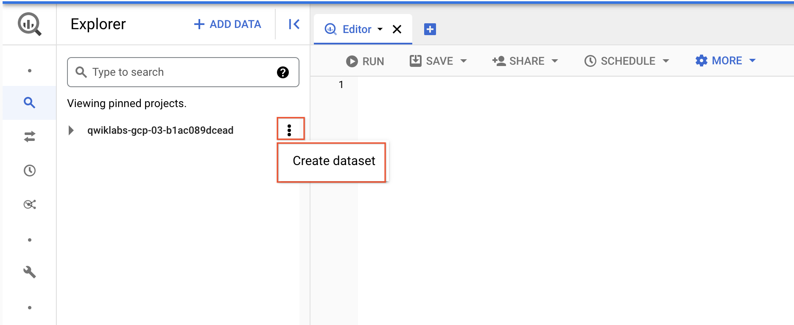

2) Nombre el Dataset como **fruit_store**. 

    Deje las demás opciones con sus valores predeterminados.

3) Haga clic en **Crear conjunto de datos** (Create dataset).

4) Creamos un dataset, donde guardamos las tablas y consultas.
Este paso es solo preparatorio.


#
## Tarea 2 - Practicar  con Arreglos (Arrays) en SQL.

Normalmente en SQL tendrás un único valor para cada fila como esta **lista de frutas** :

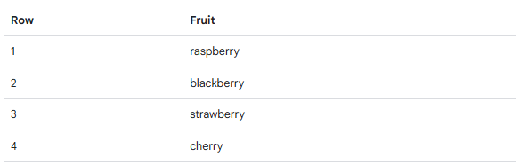

¿Qué pasaría si quisieras una lista de frutas para cada persona en la tienda? 

Podría ser algo así:

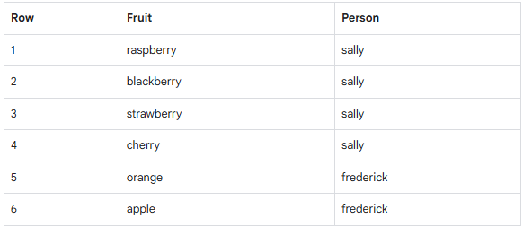

En bases de datos relacionales tradicionales con SQL, la repetición de nombres generalmente indicaría la necesidad de dividir la tabla en dos tablas separadas.: 

`"Frutas"` y `"Personas"`. 

Este proceso se llama normalización (de una tabla a muchas) y es un enfoque común en bases de datos transaccionales, como MySQL. 

En contraste, para el almacenamiento de datos (data warehousing), los analistas de datos suelen seguir el enfoque opuesto, la desnormalización, que implica combinar varias tablas separadas en una sola tabla grande.


#

Ahora, vamos a aprender un enfoque diferente que soluciona estos problemas almacenando datos en diferentes niveles de granularidad dentro de una sola tabla, utilizando campos repetidos.

En lugar de dividir la información en varias tablas como ocurre con la normalización, este enfoque permite almacenar datos más complejos y jerárquicos dentro de una sola tabla, manteniendo la relación entre los datos sin redundancia de almacenamiento, lo cual mejora el rendimiento y la consistencia

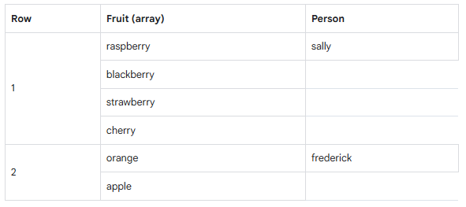

¿Qué resulta extraño en la tabla anterior?

- Solo hay dos filas.

- En la columna "Fruta", aparecen varios valores en una sola celda.

- Cada persona está relacionada con una lista de frutas, no con una sola.


¿Cuál es la clave para entenderlo?

El tipo de dato ARRAY.

**Una forma más clara de interpretarlo:**

Un campo de tipo ARRAY permite almacenar varios valores dentro de una única celda.
En lugar de repetir la persona en múltiples filas (una por cada fruta), agrupamos todos esos valores en un solo campo estructurado.

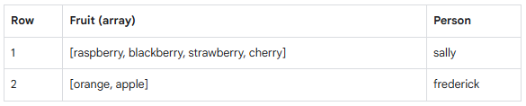


✅ Ambas tablas son estructuralmente iguales (en términos de datos).
Aunque una se ve más “extendida”, en realidad ambas contienen la misma información. La diferencia está en cómo BigQuery muestra los arrays.

Ambas tablas son exactamente iguales.

 Hay dos aprendizajes clave aquí:

- Un array es simplemente una lista de elementos encerrados entre corchetes [ ].

  Por ejemplo: ["apple", "banana", "cherry"]

- BigQuery muestra los arrays de manera visualmente "aplanada". Esto significa que lista los valores del array de forma vertical (aunque todos esos valores siguen perteneciendo a una sola fila).
Esto ayuda a interpretar arrays complejos de manera más sencilla, ya que cada valor se muestra en una línea separada, pero sigue formando parte del mismo registro.

👀 ¿Por qué es útil?

Este comportamiento visual:

- Facilita la lectura de arrays con muchos elementos.

- Permite inspeccionar datos complejos sin perder el contexto de la fila a la que pertenecen.

- Ayuda a identificar errores o patrones sin tener que desanidar manualmente.

**Pruébalo tú mismo**

puedes ingresar lo siguiente en el editor de consultas en Bigquery:

```sql
-- Esto genera una tabla con una sola fila y una sola columna llamada fruit_array, que contiene un ARRAY de strings.

SELECT
['raspberry', 'blackberry', 'strawberry', 'cherry'] AS fruit_array
```

Click **Run**.

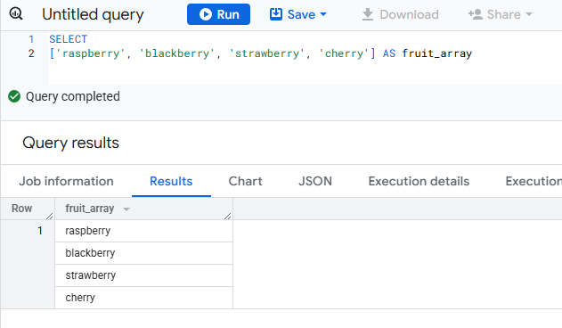

Ahora intenta ejecutar esta consulta:

```sql
SELECT
['raspberry', 'blackberry', 'strawberry', 'cherry', 1234567] AS fruit_array
```


Debería recibir un error parecido al siguiente:

    Error: Array elements of types {INT64, STRING} do not have a common supertype at [3:1]
  Los datos en un array deben ser todos del mismo tipo.

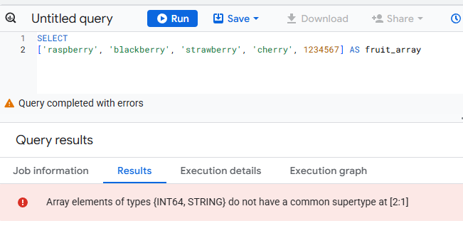

📌 ¿Por qué ocurre?

En BigQuery, los arrays deben contener elementos del mismo tipo de datos.

En tu ejemplo:

  - 'raspberry', 'blackberry', etc., son strings.

  - 1234567 es un entero (INT64).

  - Como mezclaste strings y números, el array es inválido.

¿Cómo solucionarlo?

Si querés que todos los elementos estén en el mismo array, deben ser del mismo tipo.

Por ejemplo, convirtiendo el número a string:

```sql
SELECT
['raspberry', 'blackberry', 'strawberry', 'cherry', '1234567'] AS fruit_array
```
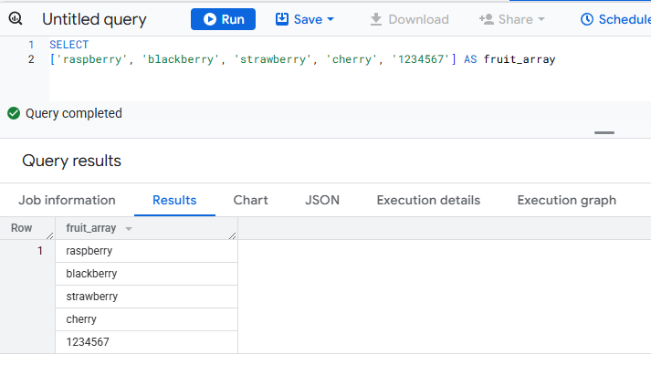

#

Aquí está la tabla final para realizar consultas:


```sql

SELECT person, fruit_array, total_cost FROM `data-to-insights.advanced.fruit_store`;


/* 
esta consulta está pidiendo que se muestren tres columnas:

          person,  fruit_array  , total_cost

 todo esto de la tabla fruit_store en el conjunto de datos advanced dentro del proyecto data-to-insights.

*/
```

Click **Run**.

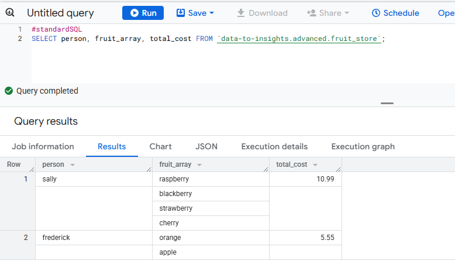

Después de ver los resultados, haga clic en la pestaña JSON para ver la estructura anidada de los resultados.

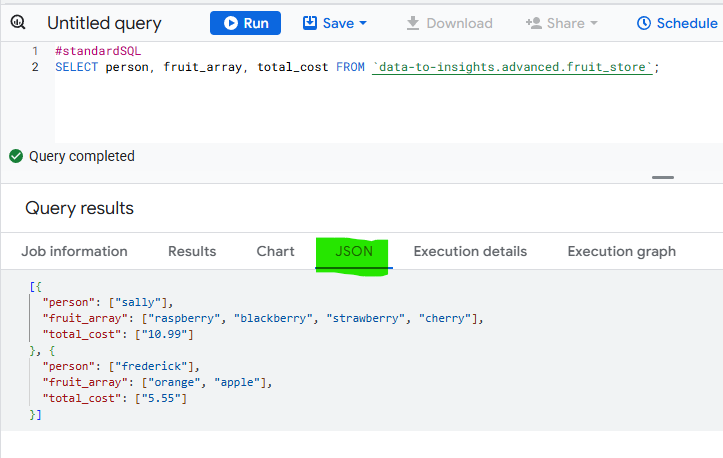


#### Resumen

- BigQuery admite arreglos de forma nativa

- Los valores dentro de un arreglo deben compartir el mismo tipo de dato

- En BigQuery, los arreglos se llaman campos REPEATED.

#
## Tarea 3 -  Crear tus propios arreglos con `ARRAY_AGG()`  

¿No tenés arreglos en tus tablas? 

Podés crearlos !!!

Copiá y pegá la siguiente consulta para explorar este conjunto de datos público:

```sql
SELECT
  fullVisitorId,
  date,
  v2ProductName,
  pageTitle
  FROM `data-to-insights.ecommerce.all_sessions`
WHERE visitId = 1501570398
ORDER BY date
```
```sql
-- esta consulta está extrayendo el ID del visitante, la fecha, el nombre del producto y el título de la página de la tabla all_sessions para una sesión específica (identificada por visitId = 1501570398) y los muestra en orden cronológico según la fecha.
```

Ahora usaremos la función ARRAY_AGG() para agrupar nuestros valores de texto en un Array.
Copiá y pegá la siguiente consulta para explorar este conjunto de datos público:


```sql
SELECT
  fullVisitorId,
  date,
  ARRAY_AGG(v2ProductName) AS products_viewed,
  ARRAY_AGG(pageTitle) AS pages_viewed
  FROM `data-to-insights.ecommerce.all_sessions`
WHERE visitId = 1501570398
GROUP BY fullVisitorId, date
ORDER BY date
```

A continuación, usaremos la función ARRAY_LENGTH() para contar la cantidad de páginas y productos que fueron vistos:


```sql
SELECT
  fullVisitorId,
  date,
  ARRAY_AGG(v2ProductName) AS products_viewed,
  ARRAY_LENGTH(ARRAY_AGG(v2ProductName)) AS num_products_viewed,
  ARRAY_AGG(pageTitle) AS pages_viewed,
  ARRAY_LENGTH(ARRAY_AGG(pageTitle)) AS num_pages_viewed
  FROM `data-to-insights.ecommerce.all_sessions`
WHERE visitId = 1501570398
GROUP BY fullVisitorId, date
ORDER BY date

```


Ahora, vamos a eliminar los duplicados de las páginas y productos para ver cuántos productos únicos fueron vistos.
Simplemente vamos a agregar DISTINCT a nuestra función ARRAY_AGG():


```sql
SELECT
  fullVisitorId,
  date,
  ARRAY_AGG(DISTINCT v2ProductName) AS products_viewed,
  ARRAY_LENGTH(ARRAY_AGG(DISTINCT v2ProductName)) AS distinct_products_viewed,
  ARRAY_AGG(DISTINCT pageTitle) AS pages_viewed,
  ARRAY_LENGTH(ARRAY_AGG(DISTINCT pageTitle)) AS distinct_pages_viewed
  FROM `data-to-insights.ecommerce.all_sessions`
WHERE visitId = 1501570398
GROUP BY fullVisitorId, date
ORDER BY date
```

Resumen

- Podés hacer cosas bastante útiles con los Array, como:

- Encontrar la cantidad de elementos con ARRAY_LENGTH(<arreglo>)

- Eliminar duplicados con ARRAY_AGG(DISTINCT <campo>)

- Ordenar elementos con ARRAY_AGG(<campo> ORDER BY <campo>)

- Limitar la cantidad con ARRAY_AGG(<campo> LIMIT 5)
#
## Tarea 4 - Consulta de conjuntos de datos que ya tienen ARREGLOS (ARRAYs)

El conjunto de datos público de BigQuery para Google Analytics, `bigquery-public-data.google_analytics_sample`, tiene muchas más columnas y filas en comparación con el conjunto de datos que usamos en el curso, `data-to-insights.ecommerce.all_sessions`.

Lo más importante es que el conjunto de Google Analytics ya almacena valores de campos como productos, páginas y transacciones de forma nativa como arreglos (ARRAYs). Esto significa que datos como los productos comprados, las páginas visitadas o las transacciones se guardan en un solo campo como un arreglo, lo que facilita la manipulación de múltiples valores relacionados dentro de una misma entrada.

1) Copiá y pegá la siguiente consulta para explorar los datos disponibles y ver si podés encontrar campos con valores repetidos (arreglos):

```sql
SELECT
  *
FROM `bigquery-public-data.google_analytics_sample.ga_sessions_20170801`
WHERE visitId = 1501570398
```

2) **Run** the query.

3) Desplazate hacia la derecha en los resultados hasta que veas el campo `hits.product.v2ProductName` (pronto hablaremos sobre los múltiples alias de campos).

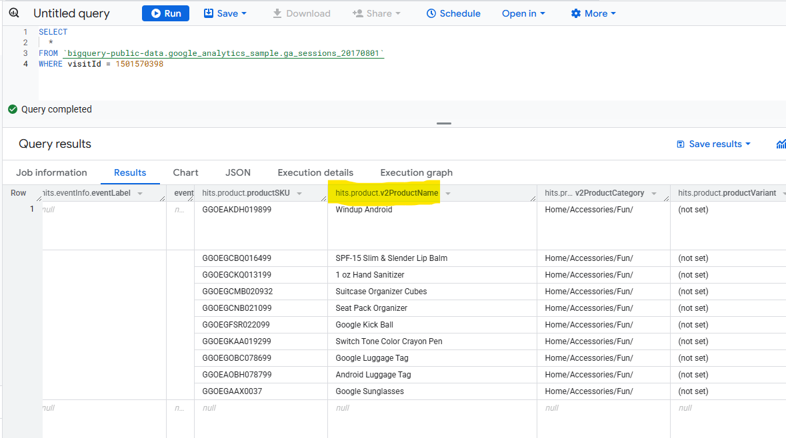


4) La cantidad de campos disponibles en el esquema de Google Analytics puede resultar abrumadora para nuestro análisis. Intentemos consultar solo los campos de visita y nombre de página como hicimos antes:

```sql
SELECT
  visitId,
  hits.page.pageTitle
FROM `bigquery-public-data.google_analytics_sample.ga_sessions_20170801`
WHERE visitId = 1501570398

```
Recibirás un error:
```
Cannot access field product on a value with type ARRAY> at [5:8]
```

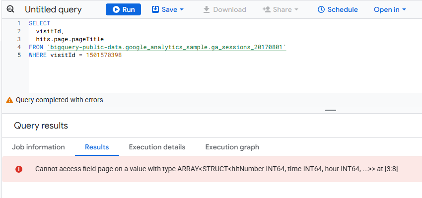

Antes de poder consultar campos `REPEATED`  con normalidad, primero es necesario dividir las Arrays en filas.

Por ejemplo, el Array para `hits.page.pageTitle` se almacena actualmente como una sola fila, como se muestra a continuación:

```
['homepage','product page','checkout']
```

Y lo necesitamos para ser:

```
['homepage',
'product page',
'checkout']
```

¿Cómo lo hacemos con SQL?

Respuesta: Usa la función UNNEST() en el campo de tu matriz:

```sql
SELECT DISTINCT
  visitId,
  h.page.pageTitle
FROM `bigquery-public-data.google_analytics_sample.ga_sessions_20170801`,
UNNEST(hits) AS h
WHERE visitId = 1501570398
LIMIT 10
```
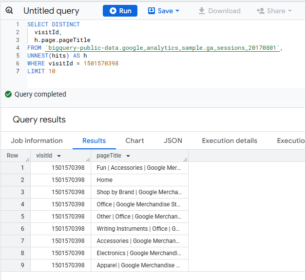


Más adelante profundizaremos en el uso de UNNEST(), pero por ahora, solo ten presente lo siguiente:

- UNNEST() es necesario cuando trabajás con ARRAYs, ya que permite convertir los elementos del arreglo en filas individuales, facilitando su análisis.

- Siempre se utiliza después del nombre de la tabla en la cláusula FROM, porque conceptualmente actúa como si estuvieras accediendo a una tabla interna unida a la principal.

En resumen, pensá en UNNEST() como una herramienta que te permite descomprimir arreglos dentro de tus datos, tratándolos como si fueran tablas normales para analizarlos con más detalle.


#
## Tarea 5 - Introducción a STRUCTs

Quizás te hayas preguntado por qué el alias de campo `hit.page.pageTitle` parece tener tres niveles separados por puntos. Esto no significa que sean tres campos distintos, sino que estás viendo un ejemplo de cómo se estructuran los datos cuando se usan tipos de datos complejos en SQL.

Así como los ARRAYs te permiten almacenar múltiples valores dentro de una sola fila, existe otro tipo de dato que te da flexibilidad para agrupar varios campos relacionados bajo un mismo nombre: el tipo STRUCT.

¿Qué es un STRUCT?

La forma más simple de entender un STRUCT es imaginarlo como una tabla interna incorporada dentro de otra tabla. Es un contenedor que puede incluir:

- Uno o varios campos

- Campos con tipos de datos distintos o iguales

- Un alias propio para acceder a su contenido

Esto permite que campos como `hit.page.pageTitle` reflejen esta jerarquía:

- `hit` es una estructura

- dentro de ella, `page` es otra estructura

- y dentro de esa, `pageTitle` es un campo concreto

¿Por qué es útil?

Porque permite mantener los datos organizados de forma lógica, especialmente cuando se trabaja con información compleja como interacciones web, productos, eventos o sesiones. En lugar de separar todo en muchas tablas, los STRUCTs te permiten manejar esa complejidad dentro de una misma tabla.

### Exploremos un conjunto de datos con STRUCT


1) En el Explorador, busque el conjunto de datos `bigquery-public-data`.
2) Si aún no está presente, haga clic en **ADD > Star a project by name.**
3) Click **Enter project name.**
4) Enter `bigquery-public-data` and click **Star**.
5) Haga clic en `bigquery-public-data` en la lista de proyectos anclados para expandirla.
6) Busque y abra `google_analytics_sample`.
7) Haga clic en la tabla `ga_sessions`.
8) Comience a desplazarse por el esquema y responda la siguiente pregunta usando la función de búsqueda de su navegador (p. ej., Ctrl + F). Consejo: Expanda todas las columnas antes de empezar a contar.


9) Como puedes imaginar, se almacena una cantidad increíble de datos de sesión en un sitio web de comercio electrónico moderno. La principal ventaja de tener 32 STRUCT en una sola tabla es que permite ejecutar consultas como esta sin necesidad de realizar uniones (JOINs):


```sql
SELECT
  visitId,
  totals.*,
  device.*
FROM `bigquery-public-data.google_analytics_sample.ga_sessions_20170801`
WHERE visitId = 1501570398
LIMIT 10
```
Almacenar sus grandes tablas de informes como STRUCT (tablas preunidas) y ARRAY (granularidad profunda) le permite:

- Obtener importantes ventajas de rendimiento al evitar uniones de 32 tablas.
- Obtener datos granulares de los ARRAY cuando los necesite, sin penalizaciones si no lo hace (BigQuery almacena cada columna individualmente en el disco).
- Tener todo el contexto empresarial en una sola tabla, en lugar de preocuparse por las claves de unión y qué tablas contienen los datos que necesita.

#

## Tarea 6 - Práctica con STRUCTs y ARRAYs


El siguiente conjunto de datos serán los tiempos de vuelta de los corredores en la pista. Cada vuelta se llamará "split".

1) Con esta consulta, pruebe la sintaxis STRUCT y observe los diferentes tipos de campos dentro del contenedor de estructura:

```sql
#standardSQL
SELECT STRUCT("Rudisha" as name, 23.4 as split) as runner
```
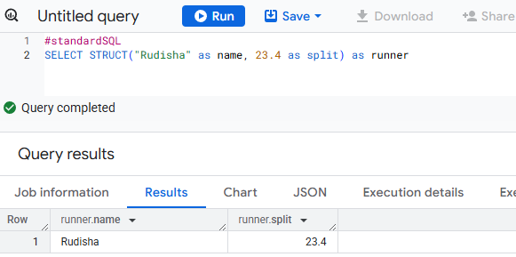


¿Qué observas sobre los alias de campo? 

Dado que hay campos anidados dentro de la estructura (nombre y división son un subconjunto de corredor), se obtiene una notación de punto.

¿Qué ocurre si el corredor tiene varios tiempos parciales para una misma carrera (como el tiempo por vuelta)?


2) Ejecute la siguiente consulta para confirmar:

```sql
#standardSQL
SELECT STRUCT("Rudisha" as name, [23.4, 26.3, 26.4, 26.1] as splits) AS runner
```
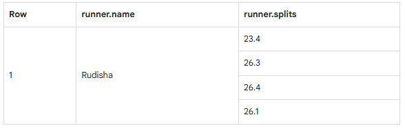

En resumen:

- Las estructuras son contenedores que pueden contener múltiples nombres de campo y tipos de datos anidados.

- Los arrays pueden ser uno de los tipos de campo dentro de una estructura (como se muestra arriba con el campo "splits").


### Practica la ingesta de datos JSON

1) Crea un nuevo conjunto de datos titulado "racing".

2) Crea una nueva tabla titulada "race_results".

3) Ingiere este archivo JSON de Google Cloud Storage:

```sql
cloud-training/data-insights-course/labs/optimizing-for-performance/race_results.json
```
- **Source**: Google Cloud Storage under **Create table from** dropdown.
- **Select file from GCS bucket**: cloud-training/data-insights-course/labs/- optimizing-for-performance/race_results.json
- **File format**: JSONL (Newline delimited JSON)
- In **Schema**, move the **Edit as text** slider and add the following:


```json
[
    {
        "name": "race",
        "type": "STRING",
        "mode": "NULLABLE"
    },
    {
        "name": "participants",
        "type": "RECORD",
        "mode": "REPEATED",
        "fields": [
            {
                "name": "name",
                "type": "STRING",
                "mode": "NULLABLE"
            },
            {
                "name": "splits",
                "type": "FLOAT",
                "mode": "REPEATED"
            }
        ]
    }
]
```


4) Click Create table.

5) Una vez que el trabajo de carga se haya realizado correctamente, obtenga una vista previa del esquema para la tabla recién creada:


¿Qué campo es la estructura? ¿Cómo lo sabes?

El campo **participantes** es la **STRUCT** porque es de tipo **RECORD**.

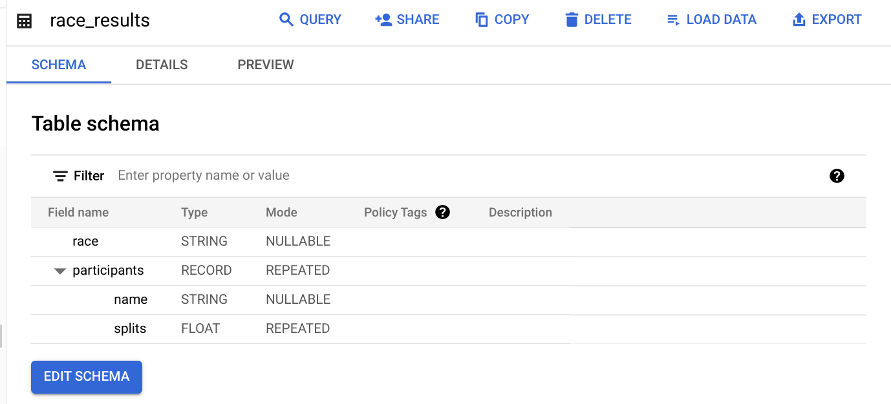

¿Qué campo es el array?

El campo `participantes.splits` es un array de valores flotantes dentro de la estructura principal `participantes`. Tiene un modo REPEATED, lo que indica un array. Los valores de ese array se denominan valores anidados, ya que son múltiples valores dentro de un solo campo.


### Practica la consulta de campos anidados y repetidos

1) Veamos a todos nuestros corredores para la carrera de 800 metros:

```sql
#standardSQL
SELECT * FROM racing.race_results
```
¿Cuántas filas fueron devueltas?

**La respuesta correcta es:**

 👉 : 1.

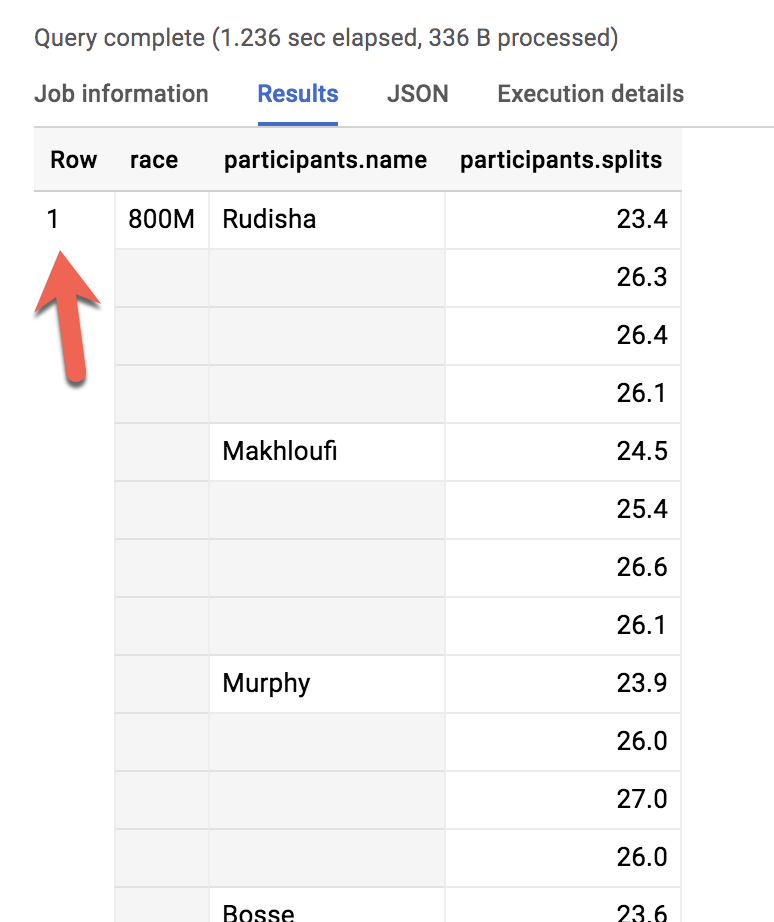


¿Qué pasaría si quisieras enumerar el nombre de cada corredor y el tipo de carrera?


2) Ejecute el siguiente esquema y vea qué sucede:

```sql
#standardSQL
SELECT race, participants.name
FROM racing.race_results

```
`Error: Cannot access field name on a value with type ARRAY\<STRUCT\<name STRING, splits ARRAY\<FLOAT64\>>>> at [1:21]`


Al igual que olvidarse de GROUP BY al usar funciones de agregación, aquí hay dos niveles de granularidad: una fila para la carrera y tres filas para los nombres de los participantes. 

¿Cómo se cambia esto?

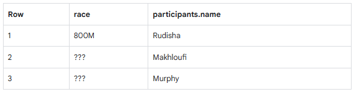

...a esto:


En SQL relacional tradicional, si tuviera una tabla de carreras y una de participantes, ¿qué haría para obtener información de ambas? Las uniría. En este caso, el STRUCT de participantes (que conceptualmente es muy similar a una tabla) ya forma parte de la tabla de carreras, pero aún no está correlacionado correctamente con el campo "carrera" (no STRUCT).

¿Se le ocurre qué comando SQL de dos palabras usaría para correlacionar la carrera de 800 m con cada uno de los participantes de la primera tabla?

**La respuesta correcta es:**

 👉 : CROSS JOIN (UNIÓN CRUZADA)

3) Ahora intenta ejecutar esto:

```sql
#standardSQL
SELECT race, participants.name
FROM racing.race_results
CROSS JOIN
participants  # this is the STRUCT (it's like a table within a table)
```
`Error: Table name "participants" cannot be resolved: dataset name is missing`


Si bien el STRUCT de participantes es como una tabla, técnicamente sigue siendo un campo en la tabla `racing.race_results`.


4) Agregue el nombre del conjunto de datos a la consulta:


```sql
#standardSQL
SELECT race, participants.name
FROM racing.race_results
CROSS JOIN
race_results.participants # full STRUCT name


```


5) Click Run.

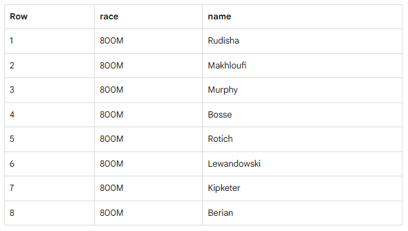

Has listado a todos los corredores de cada carrera!


Puedes simplificar la última consulta:

- Añadir un alias a la tabla original.
- Reemplazar las palabras "CROSS JOIN" por una coma (una coma implica una unión cruzada).

Esto dará el mismo resultado de la consulta:

```sql
#standardSQL
SELECT race, participants.name
FROM racing.race_results AS r, r.participants
```
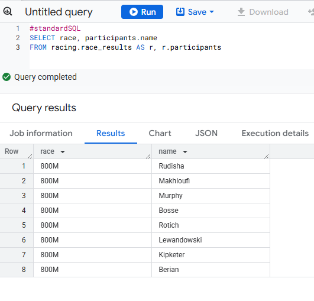

Si tiene más de un tipo de carrera (800M, 100M, 200M), 

¿no asociaría una unión cruzada (CROSS JOIN) cada nombre de corredor con cada carrera posible, como un producto cartesiano?

Respuesta: No. Se trata de una unión cruzada correlacionada que solo descomprime los elementos asociados a una sola fila. 

Para más información, consulte : working with ARRAYs and STRUCTs

https://cloud.google.com/bigquery/docs/arrays?hl=es-419#flattening-arrays


Resumen de STRUCTs:

- Un STRUCT de SQL es simplemente un contenedor de otros campos de datos que pueden ser de diferentes tipos. La palabra struct significa estructura de datos. Recuerde el ejemplo anterior:
- `STRUCT("Rudisha" como nombre, [23.4, 26.3, 26.4, 26.1] como divisiones) AS runner`
- Los STRUCT reciben un alias (como el runner mencionado anteriormente) y pueden considerarse conceptualmente como una tabla dentro de la tabla principal.
- Los STRUCT (y los ARRAY) deben descomprimirse antes de poder operar sobre sus elementos. Envuelva un UNNEST() alrededor del nombre del propio struct o del campo del struct que sea un array para descomprimirlo y aplanarlo.

#
## Tarea 7 - Preguntas sobre STRUCT()

Responda las siguientes preguntas utilizando la tabla `racing.race_results` que creó anteriormente.


#### **Tarea:** Escribe una consulta para contar cuántos corredores había en total.

Para empezar, utiliza la siguiente consulta parcialmente escrita:

```sql
#standardSQL
SELECT COUNT(participants.name) AS racer_count
FROM racing.race_results
```
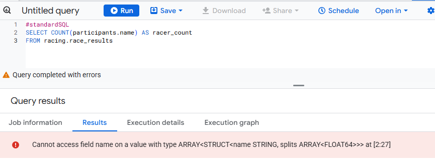

Posible solución:

```sql
#standardSQL
SELECT COUNT(p.name) AS racer_count
FROM racing.race_results AS r, UNNEST(r.participants) AS p
```
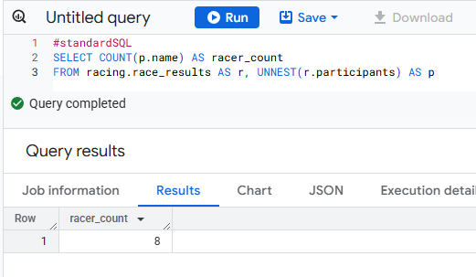

**La respuesta correcta es:**

 👉 : Había 8 corredores que corrieron la carrera.


#
## Tarea 8 - Preguntas sobre UNNEST()

Escriba una consulta que indique el tiempo total de carrera de los corredores cuyos nombres empiezan por R. Ordene los resultados con el tiempo total más rápido primero. Utilice el operador UNNEST() y comience con la consulta parcialmente escrita a continuación.

Complete la consulta:


```sql
#standardSQL
SELECT
  p.name,
  SUM(split_times) as total_race_time
FROM racing.race_results AS r
, r.participants AS p
, p.splits AS split_times
WHERE
GROUP BY
ORDER BY
;


```
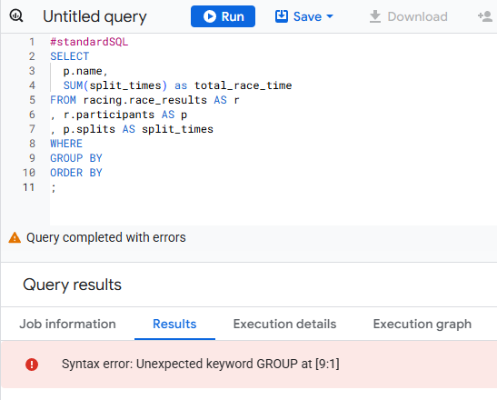

Posible solución:

```sql
#standardSQL
SELECT
  p.name,
  SUM(split_times) as total_race_time
FROM racing.race_results AS r
, UNNEST(r.participants) AS p
, UNNEST(p.splits) AS split_times
WHERE p.name LIKE 'R%'
GROUP BY p.name
ORDER BY total_race_time ASC;


```
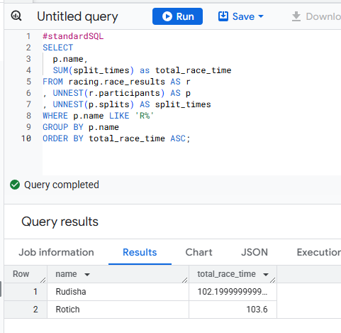


#
## Tarea 9 - Filtrar valores dentro de arrays

Observó que el tiempo de vuelta más rápido registrado en la carrera de 800 m fue de 23,2 segundos, pero no vio qué corredor corrió esa vuelta en particular. Cree una consulta que devuelva ese resultado.

Tarea: Complete la consulta parcialmente escrita:


```sql
#standardSQL
SELECT
  p.name,
  split_time
FROM racing.race_results AS r
, r.participants AS p
, p.splits AS split_time
WHERE split_time = ;


```
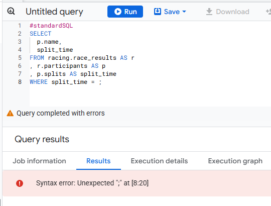

Posible solución:

```sql
#standardSQL
SELECT
  p.name,
  split_time
FROM racing.race_results AS r
, UNNEST(r.participants) AS p
, UNNEST(p.splits) AS split_time
WHERE split_time = 23.2;

```

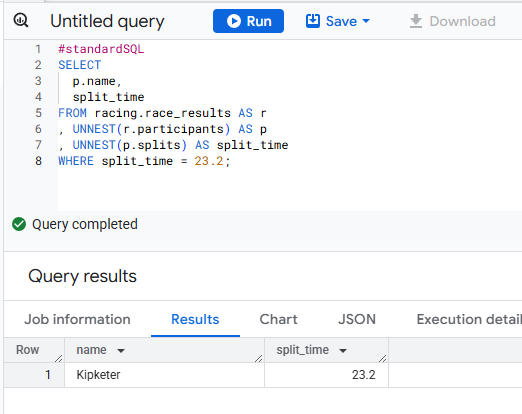

#
Autor

Este repositorio fue creado y documentado por **German Leventan Sago**  
📅 Fecha: Junio 2025  
🔗 Perfil de GitHub: [github.com/germanleventan](https://github.com/GermanPLS)

